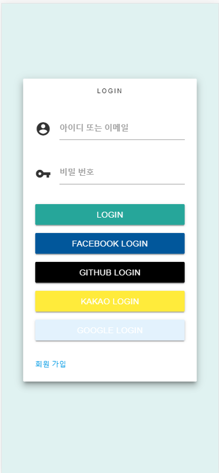

# noteAuthorizeServer
note 인증 서버

위의 화면은 로그인 페이지로 기본 로그인 및 SNS로그인을 지원 합니다.
note sever와 통신 하기위해 인증 서버에서 access_token을 발급 받고 
requset header에 발급 받은 access_token값을 넣고 요청을 해야 합니다.

---
ex) OAuth 2.0 Authorization Code Grant

http://localhost:8080/oauth/authorize?client_id=id3&redirect_uri=http://localhost:8081/callback&response_type=code&scope=read 페이지 호출 

로그인 성공시 redirect_uri로 넘겨준 (http://localhost:8081/callback) URL에 코드 값을 같이 넘겨줌 ex)  http://localhost:8081/callback?code=test

전달 받은 code로 access_token 발급
